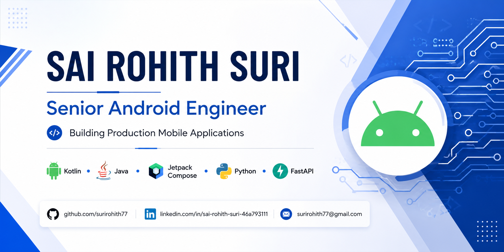

  

# 👋 Hi, I'm Sai Rohith Suri

### Senior Android Engineer | Kotlin | Java | Jetpack Compose | Python | FastAPI

Building scalable Android applications with modern architecture and production-ready backend systems.

------------------------------------------------------------------------

## 📊 GitHub Statistics

------------------------------------------------------------------------

## 👨‍💻 About Me

Senior Android Engineer with **6+ years of experience** building production Android applications using **Kotlin, Java, Jetpack Compose, MVVM, and Clean Architecture**.

I specialize in designing scalable, maintainable, and high-performance Android applications across healthcare, workforce management, and enterprise domains.

Alongside Android development, I also build backend services using **Python, FastAPI, and Django**, enabling me to deliver complete end-to-end software solutions.

------------------------------------------------------------------------

# 🚀 Tech Stack

## 📱 Android

**Core Skills**

-   Kotlin
-   Java
-   Jetpack Compose
-   Android SDK
-   MVVM
-   Clean Architecture
-   Kotlin Coroutines
-   Hilt
-   Dependency Injection
-   Android Jetpack
-   Room Database
-   Navigation Component
-   Paging 3
-   WorkManager
-   CameraX
-   Media3 (ExoPlayer)
-   DataStore
-   Retrofit
-   OkHttp
-   XML
-   ConstraintLayout
-   Material Design
-   Firebase
-   Firebase Crashlytics
-   Firebase Analytics
-   Google Play Console

## 🐍 Python Backend

-   Python
-   FastAPI
-   Django
-   Django REST Framework
-   PostgreSQL
-   RESTful APIs
-   Microservices

## 🛠 Tools

Git • GitHub • Android Studio • Gradle • Jira • Postman • Agile Scrum

------------------------------------------------------------------------

# 💼 Professional Experience

## 🏥 CareSpace

Enterprise healthcare platform focused on posture and movement
assessment.

**Highlights** - Built Android features using Kotlin and modern Android
architecture. - Implemented CameraX-based posture assessment. -
Integrated Firebase services and REST APIs. - Improved application
performance and stability. - Collaborated with backend teams to deliver
end-to-end features.

## 🚚 SAWIN MobileTech

Enterprise workforce management platform.

**Highlights** - Developed Android modules using Kotlin and MVVM. -
Implemented workforce scheduling and job management. - Integrated
payment workflows and backend APIs. - Improved offline synchronization
and performance.

## ⛏ Fleet Management System

Enterprise Android application for mining operations.

**Highlights** - Google Maps integration. - Offline-first
architecture. - Workforce scheduling. - REST API integration. -
Performance optimization.

------------------------------------------------------------------------

# 📂 Featured Personal Projects

<!-- 

 -->

-   📱 Clean Architecture Android Compose
-   📷 Posture Movement Tracker
-   🐍 FastAPI Backend
-   🏗 Modern Android Architecture Samples

------------------------------------------------------------------------

# 🏆 Certifications

-   Post Graduate Certificate -- Cloud Security
-   Post Graduate Certificate -- Internet of Things and Machine
    Intelligence

------------------------------------------------------------------------

# 🌱 Currently Learning

-   Advanced Jetpack Compose
-   Android Performance Optimization
-   FastAPI Best Practices
-   Scalable Android Architecture

------------------------------------------------------------------------

# 📫 Connect With Me

-   💼 LinkedIn: https://www.linkedin.com/in/sai-rohith-suri-46a793111
-   📧 Email: surirohith77@gmail.com
-   🌐 GitHub: https://github.com/surirohith77

------------------------------------------------------------------------

### ⭐ Thanks for visiting my profile!

**Always open to collaborating on Android and Python backend projects.**

